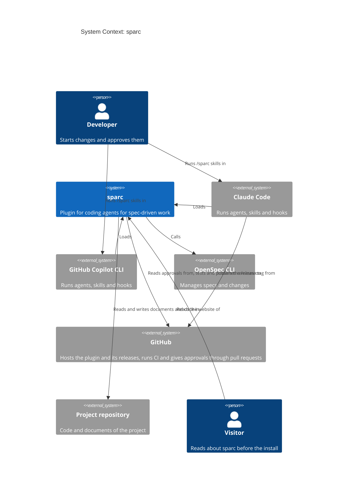
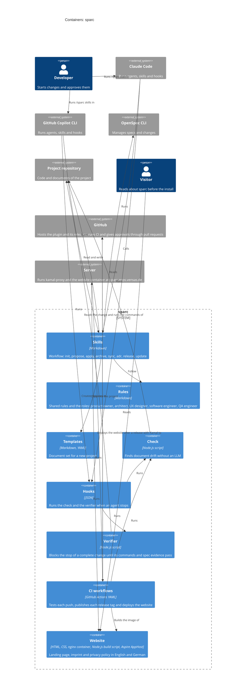

# C4 Diagrams

## System Context

```mermaid
C4Context
  title System Context: sparc
  Person(dev, "Developer", "Starts changes and approves them")
  System(sparc, "sparc", "Plugin for coding agents for spec-driven work")
  System_Ext(claude, "Claude Code", "Runs agents, skills and hooks")
  System_Ext(copilot, "GitHub Copilot CLI", "Runs agents, skills and hooks")
  System_Ext(openspec, "OpenSpec CLI", "Manages specs and changes")
  System_Ext(github, "GitHub", "Hosts the plugin and its releases, runs CI and gives approvals through pull requests")
  System_Ext(project, "Project repository", "Code and documents of the project")
  Person(visitor, "Visitor", "Reads about sparc before the install")
  Rel(dev, claude, "Runs /sparc skills in")
  Rel(dev, copilot, "Runs /sparc skills in")
  Rel(visitor, sparc, "Reads the website of")
  Rel(claude, sparc, "Loads")
  Rel(copilot, sparc, "Loads")
  Rel(claude, github, "Installs the release tag from")
  Rel(sparc, openspec, "Calls")
  Rel(sparc, project, "Reads and writes documents and code in")
  Rel(sparc, github, "Reads approvals from, tests and publishes releases on")
```

## Containers

```mermaid
C4Container
  title Containers: sparc
  Person(dev, "Developer", "Starts changes and approves them")
  System_Ext(claude, "Claude Code", "Runs agents, skills and hooks")
  System_Ext(copilot, "GitHub Copilot CLI", "Runs agents, skills and hooks")
  System_Ext(openspec, "OpenSpec CLI", "Manages specs and changes")
  System_Ext(project, "Project repository", "Code and documents of the project")
  System_Boundary(sparc, "sparc") {
    Container(skills, "Skills", "Markdown", "Workflow: init, propose, apply, archive, sync, adr, release, update")
    Container(rules, "Rules", "Markdown", "Shared rules and the roles: product owner, architect, UX designer, software engineer, QA engineer")
    Container(templates, "Templates", "Markdown, YAML", "Document set for a new project")
    Container(check, "Check", "Node.js script", "Finds document drift without an LLM")
    Container(hooks, "Hooks", "JSON", "Runs the check and the verifier when an agent stops")
    Container(verifier, "Verifier", "Node.js script", "Blocks the stop of a complete change until its commands and spec evidence pass")
    Container(ci, "CI workflows", "GitHub Actions YAML", "Tests each push, publishes each release tag and deploys the website")
    Container(website, "Website", "HTML, CSS, nginx container, Node.js build script, Aspire AppHost", "Landing page, imprint and privacy policy in English and German")
  }
  Person(visitor, "Visitor", "Reads about sparc before the install")
  System_Ext(github, "GitHub", "Hosts the plugin and its releases, runs CI and gives approvals through pull requests")
  Rel(github, ci, "Runs")
  Rel(ci, check, "Runs")
  Rel(ci, github, "Creates releases in")
  System_Ext(server, "Server", "Runs kamal-proxy and the website container at sparc.apps.vensas.de")
  Rel(ci, website, "Builds the image of")
  Rel(ci, server, "Deploys the website after a release with Kamal to")
  Rel(server, website, "Runs")
  Rel(visitor, website, "Reads")
  Rel(dev, claude, "Runs /sparc skills in")
  Rel(dev, copilot, "Runs /sparc skills in")
  Rel(claude, skills, "Runs")
  Rel(copilot, skills, "Runs")
  Rel(skills, rules, "Follow")
  Rel(skills, templates, "Copy into the project")
  Rel(claude, hooks, "Runs")
  Rel(copilot, hooks, "Runs")
  Rel(hooks, check, "Runs")
  Rel(skills, openspec, "Calls")
  Rel(skills, project, "Read and write")
  Rel(check, project, "Reads")
  Rel(hooks, verifier, "Runs")
  Rel(verifier, project, "Reads the change and runs the commands of")
  UpdateRelStyle(ci, github, $offsetX="-90", $offsetY="-60")
  UpdateRelStyle(github, ci, $offsetX="-40", $offsetY="380")
  UpdateRelStyle(hooks, verifier, $offsetY="-20")
  UpdateRelStyle(hooks, check, $offsetY="10")
  UpdateRelStyle(verifier, project, $offsetX="-20", $offsetY="-180")
  UpdateRelStyle(check, project, $offsetY="-150")
  UpdateRelStyle(skills, openspec, $offsetX="20", $offsetY="60")
```
